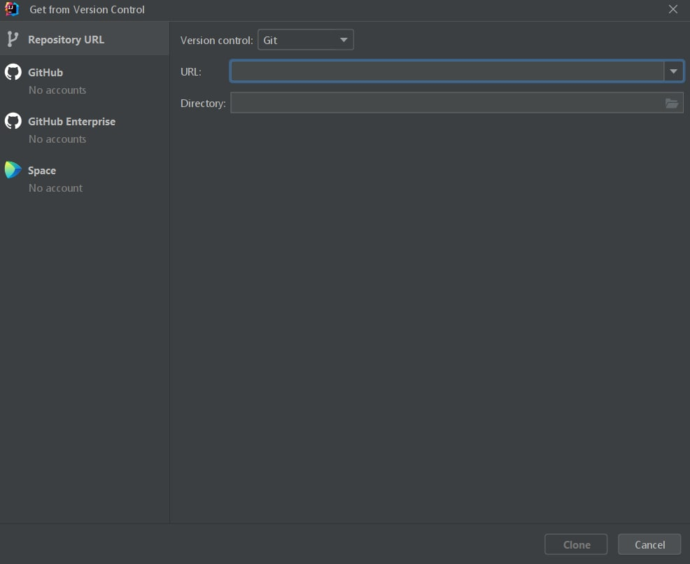
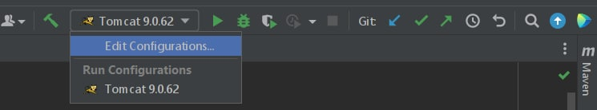
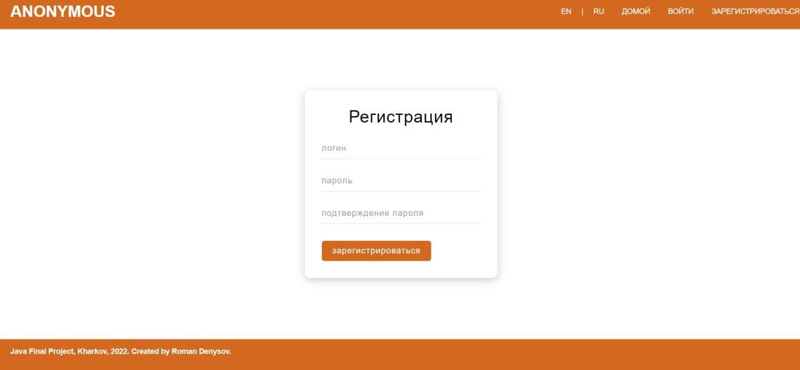
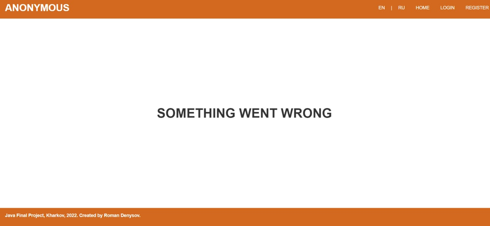
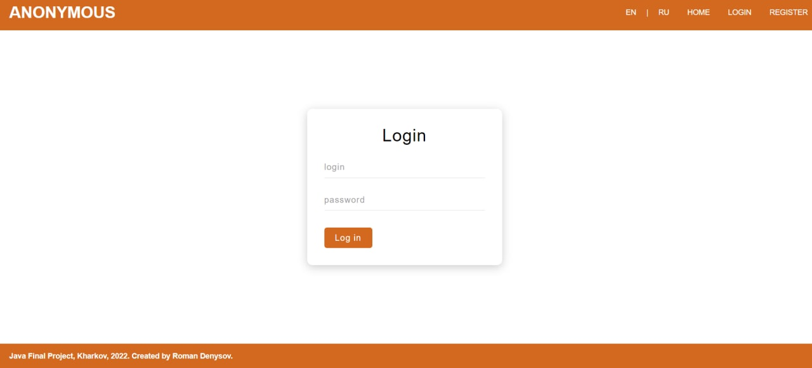
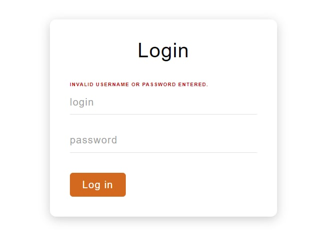
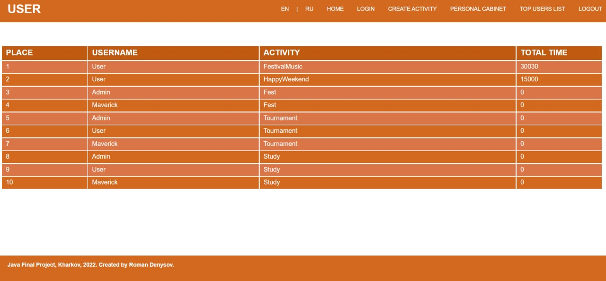
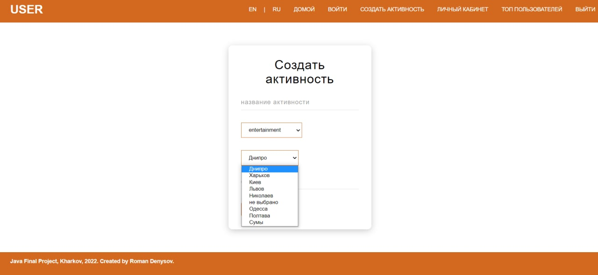
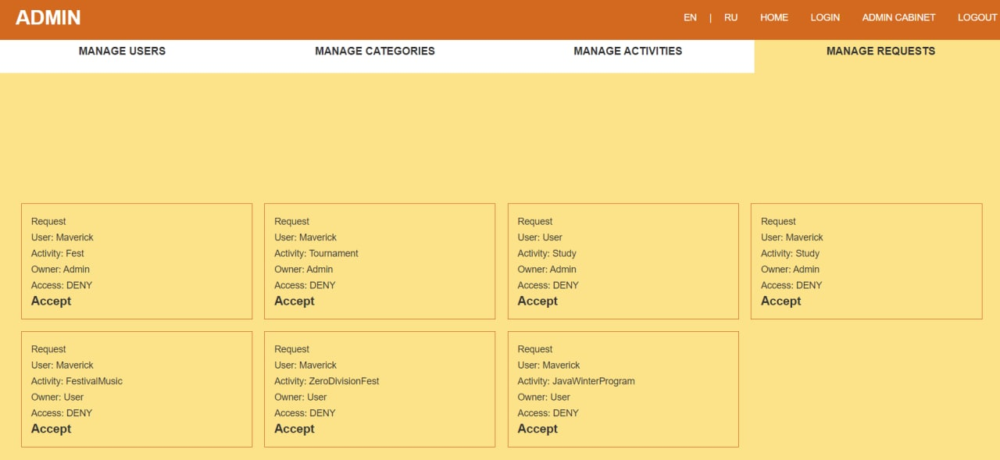

# Final Web Project
<hr>

## What is it?

**Time Tracking** is a web application written by Java. 
Time Tracking is a platform where users could place or subscribe to the *activity*.
To enter this resource you have to **sign in** or **sign up** before. 
Provided comfortable interface with pagination, filter, sort, and even if you 
desire to get **mail** this Web Application will allow you to do this.
Also, designed simple **Personal Cabinet** where you could change your profile. 
Finally, Time Tracking provides useful interface for admin. 
Admin could manipulate users, activities, categories of activity etc.

```
You could not check application on the web. I was not deploying project to the host.
```

## Technologies

1. Java Core (Collections, Generics, Multithreading, Java 8).
2. Apache Tomcat 9 as servlet container.
3. To store data used relation database - MySQL.
4. For access to data used JDBC API and customized Connection Pool.
5. The application supports work with Cyrillic and Latin.
6. The application is a multilingual (ru and en).
7. Used design and enterprise patterns (MVC, DAO, Command, Abstract Factory, Singleton...).
8. JSP, Filters, Listeners, JSTL (also designed own tags).
9. Data resubmission protection (PRG-pattern implemented).
10. Implemented an event log using log4j and sl4j.
11. Authentication and Authorization.
12. Separating access for users.
13. Password encrypting.
14. Unit and Integration tests.
15. All input fields are validated.
16. Mail API.
17. HTML, CSS, JS.

## Database diagram


## Local launch

Execute in console:

```
git clone https://github.com/RomanDenysov/timekeeping.git
```


Or clone repo following by:
1. Press to **Get from VCS** 
2. Insert URL to according field




3. Take a directory and press **Clone**
4. Congratulations!!


If something went wrong check
[this link.](https://www.educative.io/answers/how-to-clone-a-git-repository-using-the-command-line)

## Setting

```
In order to continue work you need to change setting 
according to yours. 
```

1. You have to connect Apache Tomcat 9 (I recommend this version)
For this you have to press *Edit configurations...* or *Add configuration...* 
like on a picture 




2. After it, you have to press 'Plus icon'
3. Where you have to choose *Tomcat Server* and press *Local*

``` 
If something went wrong 
I would recommend to google 'how to install Apache Tomcat'
```

## Some application screenshots







